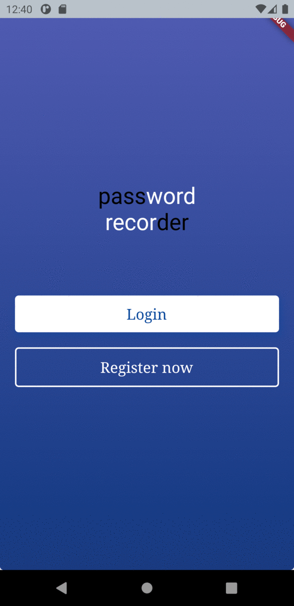
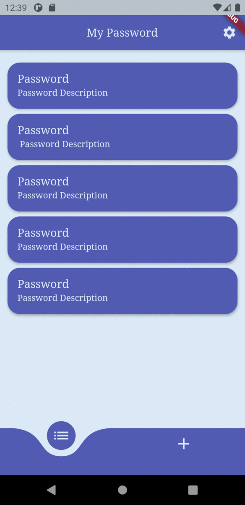
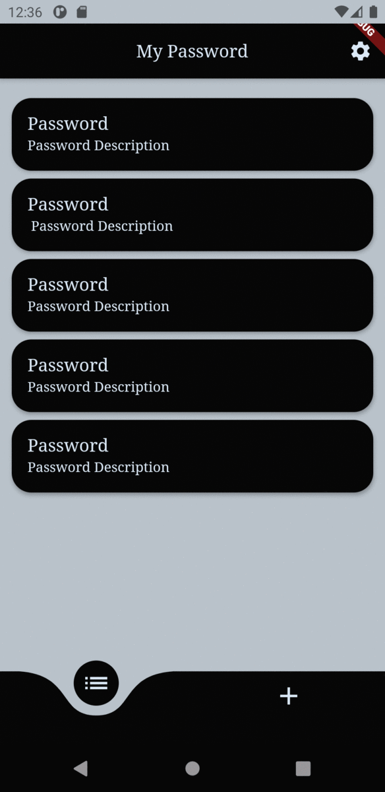

# Password Recorder

This is a freelance project for me. I want to improve my **TypeScript** and **Flutter** skills.

Now let's look at the project.

## Getting Started

Firstly if we want to use **Password Recorder** project we need to run [this](http://github.com/akturanilyas/password-recorder-api) project.

Now we can see screenshot in the application

## Screenshots

### Welcome Page Screenshots

### Light Mode Screenshots

### Dark Mode Screenshots

## Lint

I use [lint](<https://pub.dev/packages/lint>)
 to improve code quality.
